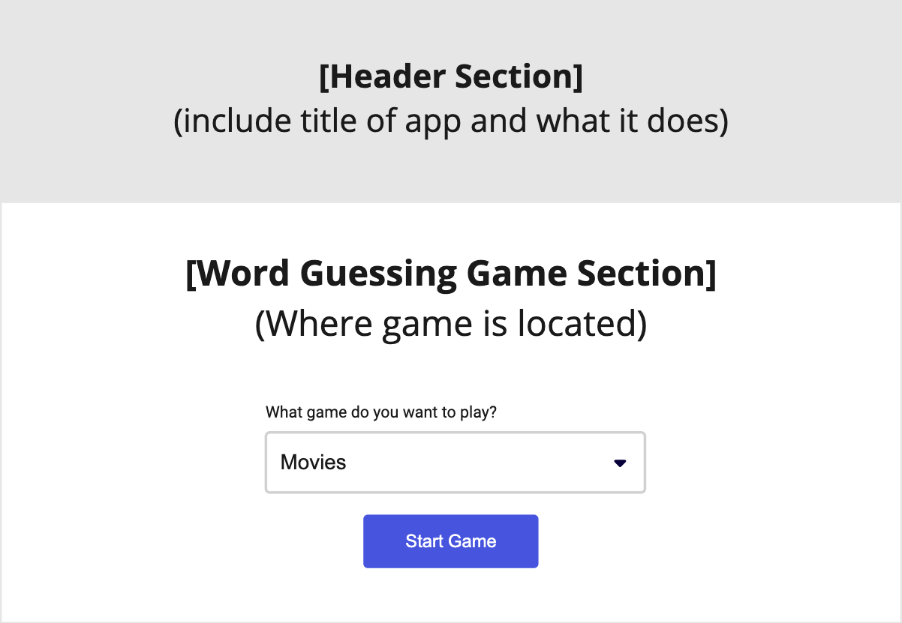
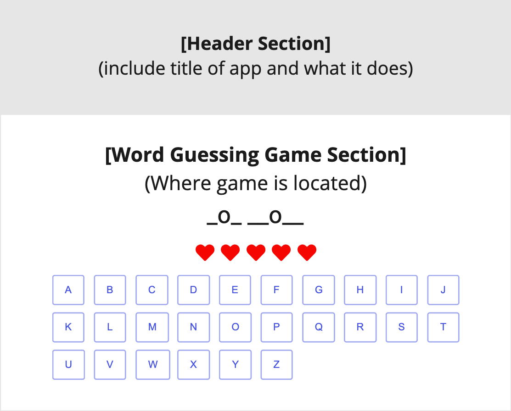
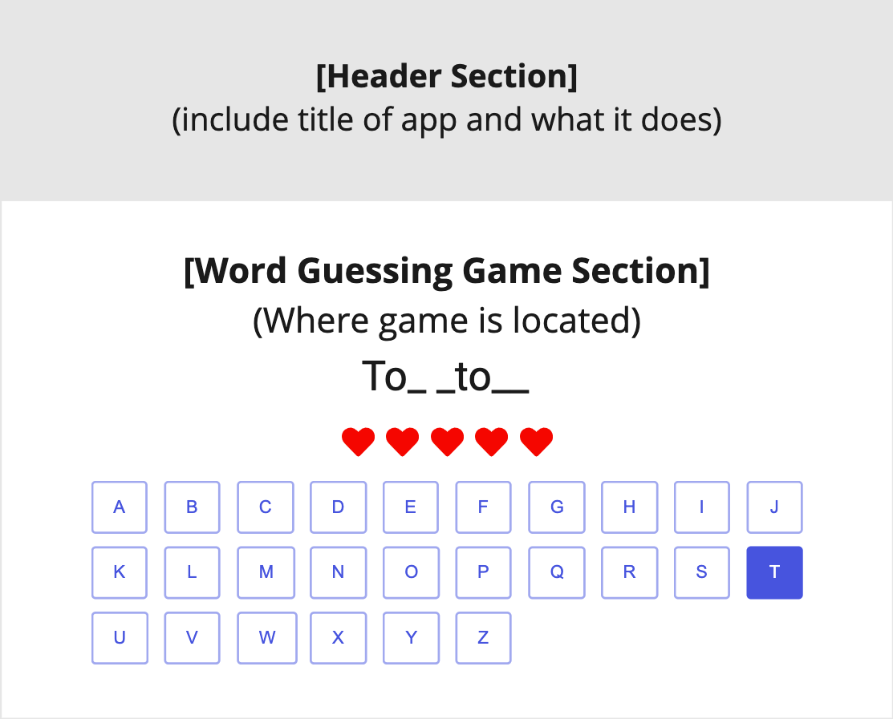
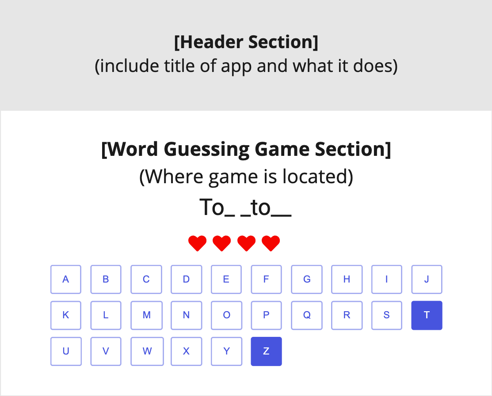
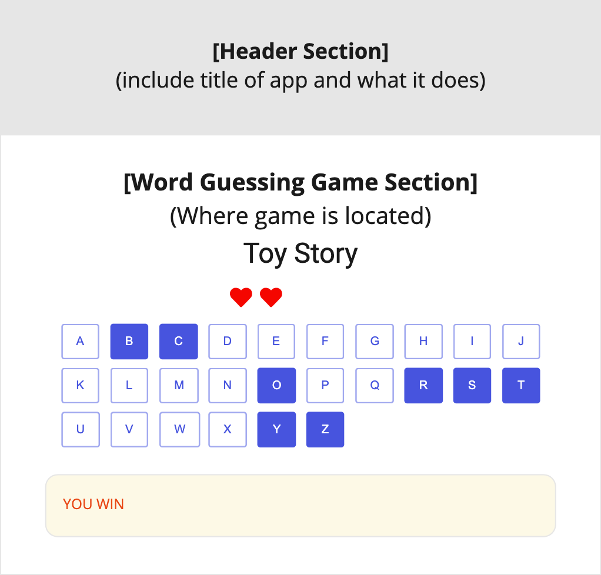
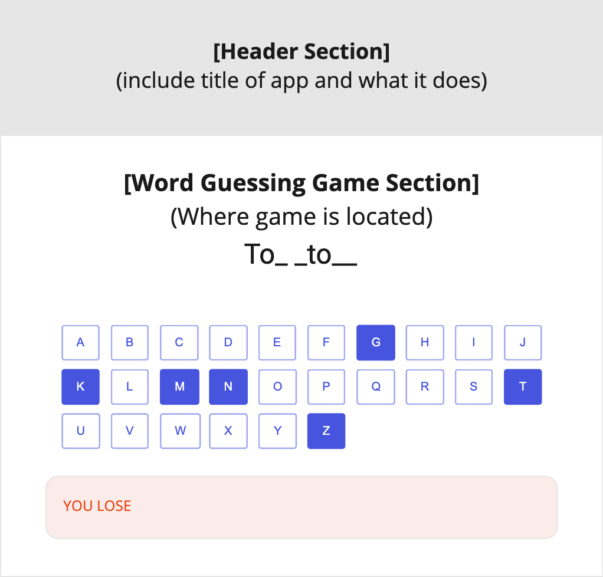

# Word Guessing Game

## User Story

> As a user I want to play the word guessing game for a specific category.

## Acceptance Criteria

- When the application starts I should be presented with a list of choices to select from
  - Please select a category:
    - Movies (default)
    - Countries
    - Food
    - Sports
- When I select a particular category then I should be presented with a random word from the selected categories list where the word is masked, i.e. the **vowels are visible** and the **consonants are masked**.
  - For instance, if the random word for a category is `Toy Story` then the masked word will be `_o_  __o__`
- When the game starts:
  - I will be presented with all the characters of the alphabet buttons that I can press.
  - I will be given **5 chances** for incorrect attempts. If I guess the wrong letter then I will lose one of the chances and when the remaining incorrect attempts reaches 0 then it is game over.
- When I click a character it will be checked against the random word and if the character **is present** then the masked word will reveal the character.
  - For instance, if I click `T` then the masked word will reveal as `To_ _to__`.
- When I enter a character it will be checked against the random word and if the character **is not present** then the remaining attempts will be decremented by 1.
  - For instance, if I guess `X` then the masked word will reveal as the previous state `To_ _to__` and my remaining incorrect attempts will be 4.

## How to get started?

Create a new react app using `create-react-app` and push the app to a new repository on GitLab.

You can use:

- [React Boostrap](https://react-bootstrap.github.io/) as your framework
- choose a colour palette from [coolors](https://coolors.co/)
- [Font Awesome icons](https://fontawesome.com/v5/docs/web/use-with/react) with React.

## Wireframes

**Use your imagination** when building your solution. You can use the following to help guide you how to structure your app.

### Initial load

### When game starts

### When clicking on the correct character

### When clicking on the incorrect character

### When you win the game

### When you lose the game

### NOTE

Add some words in the [categories](./categories.json) and use this as the data source in your application.
