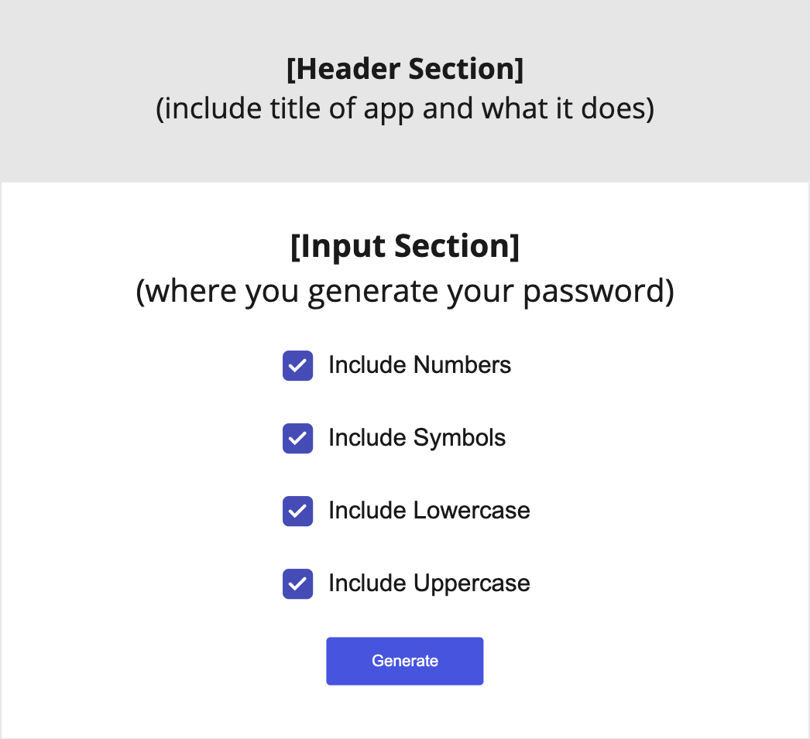
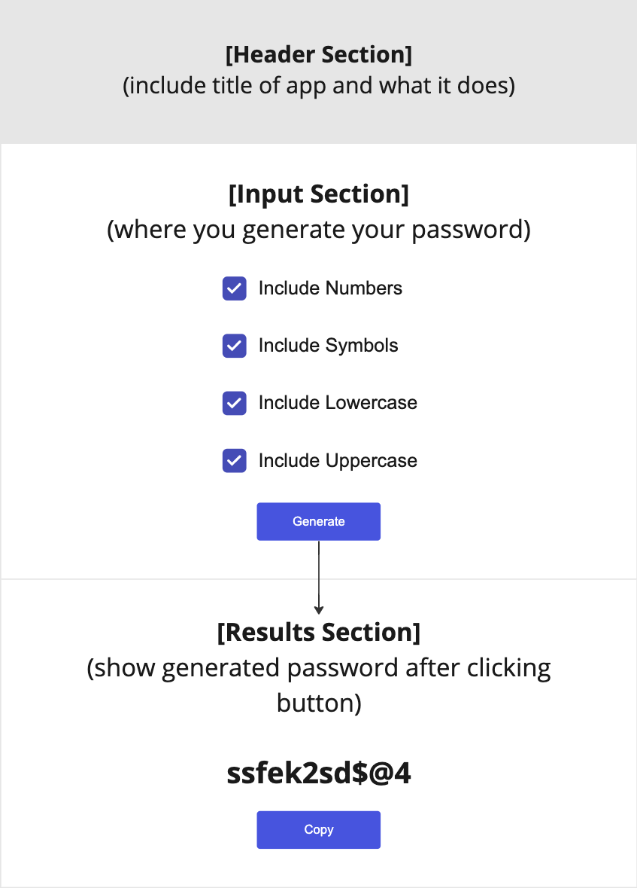

# Random Password Generator

## User Story

> As a user I want to generate a new password.

## Acceptance Criteria

- When the application starts I should be presented with:
  - four checkboxes
    - Include Numbers
    - Include Symbols
    - Include Lowercase
    - Include Uppercase
  - One button (generate)
  - A results section showing the generated password
    - also include a copy button, to allow to copy the password to the clipboard
- When a **tick** or **un-tick** any of the checkboxes and **click** the **generate button**, it should generate an appropriate password, based off my settings preferences
- When I **click** the **copy button**, it should copy the password to the clipboard

## How to get started?
Create a new react app using `create-react-app` and push the app to a new repository on GitLab.

You can use:
- [React Boostrap](https://react-bootstrap.github.io/) as your framework
- choose a colour palette from [coolors](https://coolors.co/)
- [Font Awesome icons](https://fontawesome.com/v5/docs/web/use-with/react) with React.

## Wireframes
**Use your imagination** when building your solution. You can use the following to help guide you how to structure your app.

### Initial load

### When password has been generated
