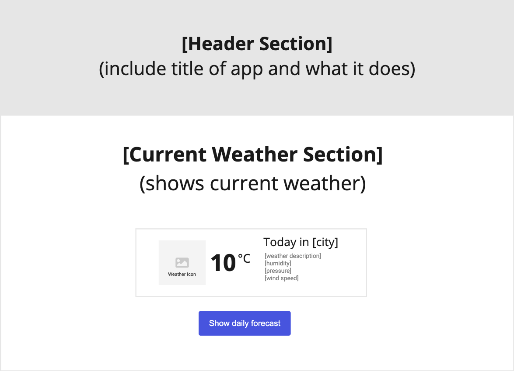
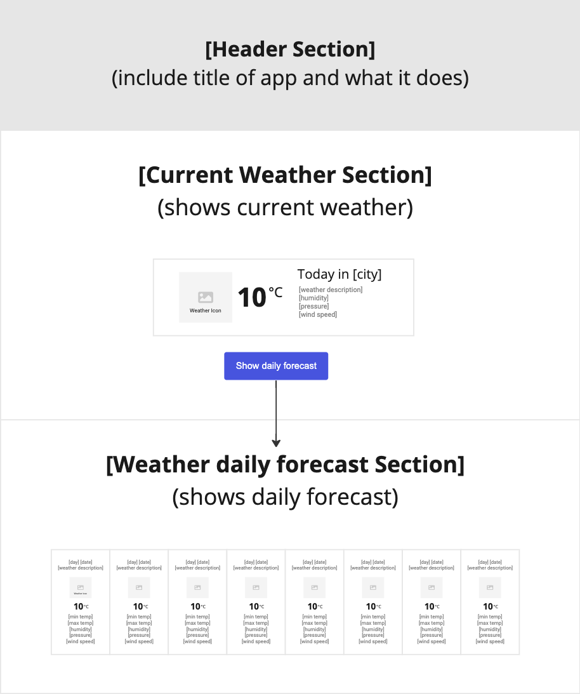

# Weather Dashboard

## User Story

> As a user I should be able to view current and an 8 day forecast weather information for a specific city

## Acceptance Criteria

- When the application starts I should **show current weather** today. I should be able to see weather information
- The weather information presented should be in **2 sections**
    - Current weather
      - on initial load
    - Daily forecast weather
      - **only show** when the daily forecast button has been clicked on
- **Current weather** information should have the following details:
    - city name
    - temperature
    - weather icon
    - humidity
    - pressure
    - wind speed
    - weather description
- **Daily forecast weather** information should be a list of containing the following details for each day:
    - formatted date (Fri 2nd Dec)
    - weather description
    - current temperature
    - weather icon
    - minimum temperature
    - maximum temperature
    - humidity
    - pressure
    - wind speed

## Resources

### URLS

[Current Data](https://api.openweathermap.org/data/2.5/weather?q=london&appid=393609ac7b2e5f25ccdd00e626ee13dd)

[Daily forecast Data](https://api.openweathermap.org/data/2.5/onecall?lat=51.5085&lon=0.1257&appid=393609ac7b2e5f25ccdd00e626ee13dd&units=imperial)

### How to get the weather Icon?

Firstly, you will need to get the **icon code** from the API (urls above). Once you have the icon code, you can use the following URL to get your icon image:

`https://openweathermap.org/img/wn/{iconCode}@4x.png`

For example, if the code is `04d`, then then the URL will be:

`https://openweathermap.org/img/wn/04d@4x.png` 

## How to get started?
Create a new react app using `create-react-app` and push the app to a new repository on GitLab.

You can use:
- [React Boostrap](https://react-bootstrap.github.io/) as your framework
- choose a colour palette from [coolors](https://coolors.co/)
- [Font Awesome icons](https://fontawesome.com/v5/docs/web/use-with/react) with React.

## Wireframes
**Use your imagination** when building your solution. You can use the following to help guide you how to structure your app.

### Initial load

### When clicking on the daily forecast button
